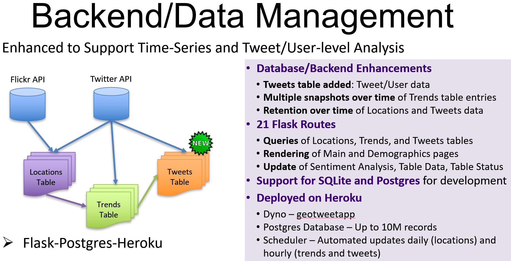
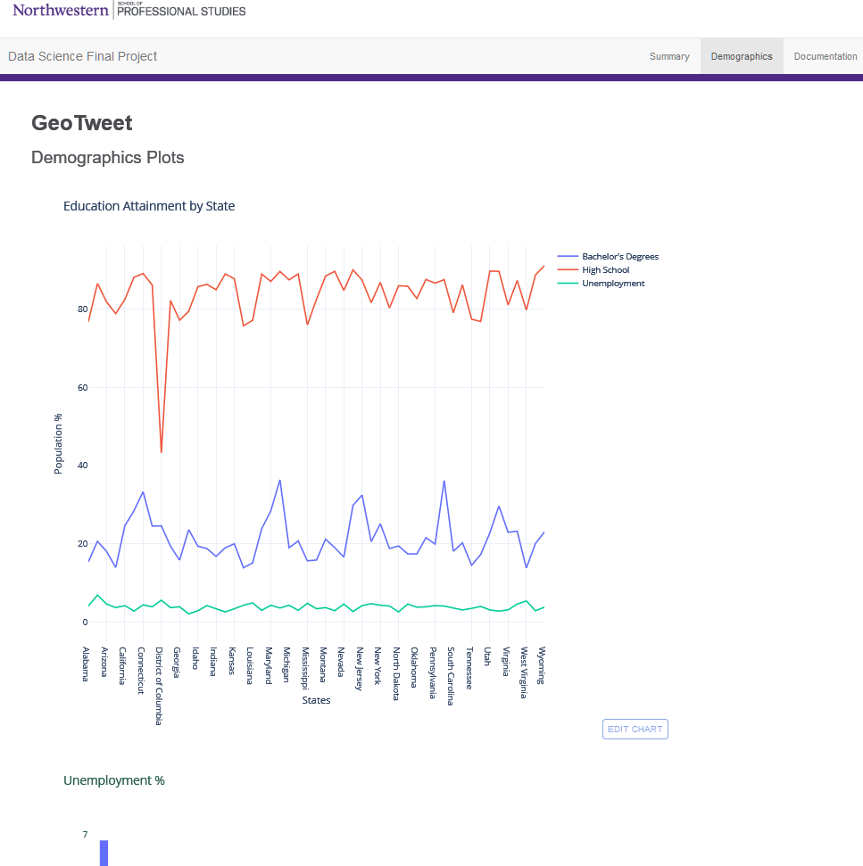

# GeoTweet

This application provides Full-stack Interactive Dashboard for examining Twitter Trends.

# Technologies Used

* Python, Flask, ETL (Extract/Translate/Load), Jupyter Notebook
* SQLAlchemy, SQLite, Postgres
* JavaScript, D3, Leaflet, Plotly
* Machine Learning
* Heroku

# Reference

* GitHub: https://github.com/daddyjab/GeoTweet
* Data Munging (Jupyter Notebook): https://github.com/daddyjab/CitiBike/blob/master/Citibike_Exploration_JAB.ipynb
* Visualization (on Tableau Public): https://public.tableau.com/profile/jeffery.brown#!/vizhome/CitiBike_with_Paths_Idle_Time_JAB_v5/StoryCitiBike
* Tableau file (tbwx): https://github.com/daddyjab/CitiBike/blob/master/CitiBike_with_Paths_Idle_Time_JAB_v5.twbx

# Contributions

* Jeffery Brown - Designed and implemented:
    * Flask application code for TBD of 21 routes
    * SQLAlchemy classes for Locations, Trends, and Tweets tables and integration for use with SQLite (Development) and Postgres (Deployment)
    * Database management functions for unattended population and update of database tables
    * Jupyter Notebooks with exploratory analysis and query examples for ease of use by teammates
    * Flexible demographics chart infrastructure and demographics chart at the bottom of the main page
    * General consultation and integration

* Data:
    * Twitter API: https://developer.twitter.com/en/docs
    * Flickr API: https://www.flickr.com/services/api/

# Summary

A summary of the GeoTweet application is provided in [PDF Format](resources/Data Science Bootcamp-Final Project.pdf), and in Figure 1 below.

| Figure 1: GeoTweet - Summary |
|----------|
|  |

# Backend/Database

A description of key elements and enhancements for the GeoTweet application backend and database, key areas of contribution for me, are provided in Figure 2 below.

| Figure 2: GeoTweet - Backend/Database |
|----------|
|  |

# Visualizations

Figure 3 below shows the GeoTweet main page, which is a dashboard containing:

* A map (upper left) of locations for which Twitter Trends are available
* A table (upper right) summarizing top trending Twitter search terms and associated Tweet volume
* A demographics chart (lower left) highlighting demographics associated with states for which a selected Twitter search term is in the Top 10
* A sentiment analysis form and chart (lower right) allowing the user to enter a search term and see the sentiment associated with 1000 assocated tweets

| Figure 3: GeoTweet - Main Page |
|----------|
|  |

Figure 4 below shows the GeoTweet demographics page, which sumarizes additional demogaphics facts

| Figure 4: GeoTweet - Demographics Page |
|----------|
|  |